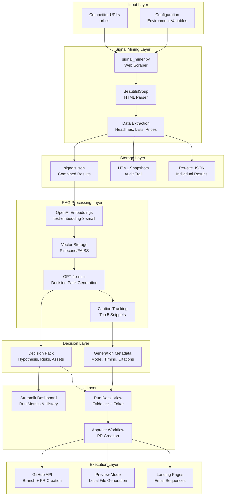

# GrowthSignal Architecture & Data Flow

## Overview

GrowthSignal is a competitive intelligence platform that transforms public competitor signals into actionable growth experiments. The system follows a modular architecture with clear separation of concerns between signal mining, RAG processing, UI presentation, and execution automation.

## System Architecture



## Component Responsibilities

### Signal Mining Layer (`Signal_Miner/`)

**`signal_miner.py`**
- **Purpose**: CLI web scraper for competitor intelligence gathering
- **Inputs**: URL list from `url.txt`, configuration parameters
- **Outputs**: Structured JSON with extracted signals, HTML snapshots
- **Technologies**: `requests`, `BeautifulSoup`, regex patterns
- **Key Features**: Multi-site processing, error handling, configurable limits

**Data Extraction**
- **Headlines & Paragraphs**: H1-H3 tags, paragraph content (min 4 words)
- **Lists**: Ordered/unordered list items
- **Prices**: Regex-based price detection ($X.XX format)
- **Specialized**: Hacker News title extraction

### RAG Processing Layer (`Signal_Miner/rfg/`)

**`generate_pack.py`**
- **Purpose**: Generate evidence-backed Decision Packs using RAG
- **Inputs**: Mining results, OpenAI API key, model configuration
- **Outputs**: Decision Pack JSON, generation metadata, citations
- **Technologies**: OpenAI API, vector similarity search, structured prompting

**`pinecone_helper.py`**
- **Purpose**: Vector store abstraction layer
- **Fallback Logic**: Pinecone → FAISS → Error handling
- **Dimensions**: 1536 (text-embedding-3-small)
- **Operations**: Upsert, query, metadata management

**Prompt Engineering**
- **Template**: `prompts/decision_pack_template.txt`
- **Structure**: Context + snippets + output schema
- **Output Format**: JSON with required fields validation

### UI Layer (`ui_app/`)

**`app.py`**
- **Purpose**: Multi-page Streamlit interface for signal review and Decision Pack management
- **Pages**: Dashboard, Run Detail, Settings
- **Features**: Auto-generation, editing, approval workflow
- **Integration**: Direct import of Signal_Miner modules

**Key Components**
- **Dashboard**: Run metrics, history, navigation
- **Run Detail**: Evidence viewer, Decision Pack editor, asset preview
- **Settings**: URL management, API key configuration

### Execution Layer (`Signal_Miner/executor/`)

**`pr_executor.py`**
- **Purpose**: GitHub PR automation and preview generation
- **Inputs**: Decision Pack, landing page HTML, GitHub credentials
- **Outputs**: GitHub PR or preview JSON file
- **Features**: Branch naming, file commits, PR templates

**Workflow Modes**
- **Live PR**: GitHub API integration with token
- **Preview Mode**: Local file generation without GitHub access

## Data Flow & File I/O

### Signal Mining Flow
```
url.txt → signal_miner.py → output/signals.json
                           → output/snapshots/domain_timestamp.html
                           → output/signals/domain_results.json
```

### RAG Generation Flow
```
signals.json → generate_pack.py → output/decision_packs/domain_timestamp.json
                                → Vector store (Pinecone/FAISS)
                                → OpenAI embeddings + LLM
                                → Decision Pack + metadata
```

### UI Processing Flow
```
Decision Pack → Streamlit UI → User editing → Save → output/decision_packs/
Approval → PR generation → output/previews/domain_pr_preview.json
```

### File Structure
```
Signal_Miner/output/
├── signals.json              # Combined mining results
├── signals/                  # Per-site individual results
│   ├── domain1_timestamp.json
│   └── domain2_timestamp.json
├── snapshots/                # HTML snapshots for audit
│   ├── domain1_timestamp.html
│   └── domain2_timestamp.html
├── decision_packs/           # Generated Decision Packs
│   └── domain_timestamp.json
├── previews/                 # PR preview files
│   └── domain_pr_preview.json
└── telemetry.json            # Usage tracking
```

## Technology Choices & Rationale

### Web Scraping
- **BeautifulSoup + lxml**: Mature, reliable HTML parsing
- **requests**: Simple HTTP client with good error handling
- **User-Agent Rotation**: Respectful crawling practices

### RAG Implementation
- **OpenAI Embeddings**: High-quality, consistent vector representations
- **text-embedding-3-small**: Cost-effective, 1536 dimensions
- **GPT-4o-mini**: Fast, cost-effective Decision Pack generation
- **Vector Store Fallback**: Pinecone (production) → FAISS (local)

### UI Framework
- **Streamlit**: Rapid prototyping, Python-native, good data display
- **Multi-page**: Dashboard + detail views for complex workflows
- **Session State**: Persistent data across page navigation

### Execution Automation
- **PyGithub**: Mature GitHub API client
- **Preview Mode**: Graceful degradation without GitHub access
- **Template-based**: Consistent PR formatting

## Model & Provider Swapping

### Embedding Models
```python
# In generate_pack.py
def make_embeddings(client, texts, model="text-embedding-3-small"):
    # Change model parameter to swap providers
    # OpenAI: text-embedding-3-small, text-embedding-3-large
    # Cohere: embed-english-v3.0
    # Local: sentence-transformers/all-MiniLM-L6-v2
```

### LLM Providers
```python
# In generate_pack.py
def call_llm_json(client, model, prompt):
    # OpenAI: gpt-4o-mini, gpt-4o, gpt-4
    # Anthropic: claude-3-haiku, claude-3-sonnet
    # Local: Ollama, LM Studio
```

### Vector Stores
```python
# In pinecone_helper.py
def get_store(embed_dim, index_name):
    # Pinecone: Cloud vector database
    # FAISS: Local in-memory storage
    # Weaviate: Self-hosted vector database
    # Qdrant: Rust-based vector database
```

## Performance Characteristics

### Signal Mining
- **Processing Speed**: ~2-5 seconds per URL (depending on size)
- **Memory Usage**: ~50-200MB per large HTML page
- **Concurrency**: Sequential processing (rate limiting compliance)

### RAG Generation
- **Embedding Time**: ~100-500ms per snippet (OpenAI API)
- **Vector Search**: ~50-200ms (Pinecone), ~10-50ms (FAISS)
- **LLM Generation**: ~2-10 seconds (GPT-4o-mini)

### UI Responsiveness
- **Page Load**: <2 seconds for typical datasets
- **Auto-generation**: 5-15 seconds end-to-end
- **Save Operations**: <1 second

## Security & Compliance

### Data Handling
- **PII Detection**: Automatic email, phone, name redaction
- **Data Retention**: 30-day snapshot retention
- **Access Control**: Demo password protection

### Web Scraping
- **Robots.txt**: Respect and logging (enforcement planned)
- **Rate Limiting**: Configurable delays (implementation planned)
- **User-Agent**: Identifiable, respectful headers

### API Security
- **Token Storage**: Environment variables, not in code
- **Rate Limiting**: OpenAI API quotas, GitHub API limits
- **Error Handling**: No sensitive data in error messages

## Scalability Considerations

### Current Limitations
- **Single-threaded**: Sequential URL processing
- **Memory**: In-memory FAISS storage
- **Storage**: Local file system only

### Planned Improvements
- **Async Processing**: Concurrent URL mining
- **Database Storage**: PostgreSQL for metadata, Redis for caching
- **Cloud Storage**: S3 for HTML snapshots
- **Horizontal Scaling**: Multiple worker processes

## Monitoring & Observability

### Logging
- **Application Logs**: Python logging to stdout
- **Telemetry**: User action tracking in JSON format
- **Error Tracking**: Exception logging with context

### Metrics
- **Processing Time**: Per-URL and per-run timing
- **Success Rates**: Mining and generation success percentages
- **API Usage**: OpenAI and GitHub API call counts

### Health Checks
- **API Connectivity**: OpenAI and GitHub API status
- **Storage Health**: Output directory accessibility
- **Memory Usage**: Process memory consumption

## Development Workflow

### Local Development
```bash
# Install dependencies
pip install -r Signal_Miner/requirements.txt
pip install -r ui_app/requirements.txt

# Run signal miner
python Signal_Miner/signal_miner.py

# Run UI
cd ui_app && streamlit run app.py

# Run tests
cd Signal_Miner && python run_tests.py
```

### Testing Strategy
- **Unit Tests**: Mocked external APIs, isolated components
- **Integration Tests**: End-to-end workflows
- **Coverage**: 80% minimum requirement
- **Security**: Bandit vulnerability scanning

### CI/CD Pipeline
- **GitHub Actions**: Automated testing on push
- **Quality Gates**: Linting, security, coverage requirements
- **Deployment**: Manual deployment process (planned automation)

## Future Architecture

### Planned Components
- **API Layer**: FastAPI REST API for external integrations
- **Queue System**: Celery for background processing
- **Monitoring**: Prometheus + Grafana for operational metrics
- **Alerting**: Slack/email notifications for failures

### Migration Path
- **Phase 1**: Add API layer alongside Streamlit UI
- **Phase 2**: Implement async processing and queues
- **Phase 3**: Add cloud storage and horizontal scaling
- **Phase 4**: Implement proper authentication and RBAC
